# 🚀 Release Flutter Desktop App

Hướng dẫn build ứng dụng Flutter trên **Windows, macOS và Linux**.

---

## 📦 Build ứng dụng

### 🔹 Windows

```sh
flutter build windows
```

Sau khi build xong, ứng dụng .exe sẽ nằm trong thư mục: **"build\windows\x64\runner\Release\MyApp.exe"**

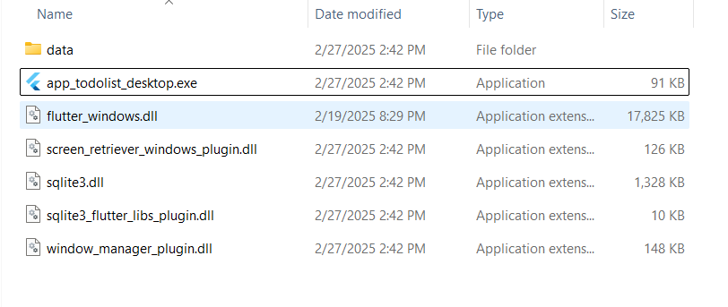

Tiếp theo cài đặt Inno setup để đóng gói ứng dụng windows:

```sh
https://jrsoftware.org/isdl.php
```

Giao diện ứng dụng như này:

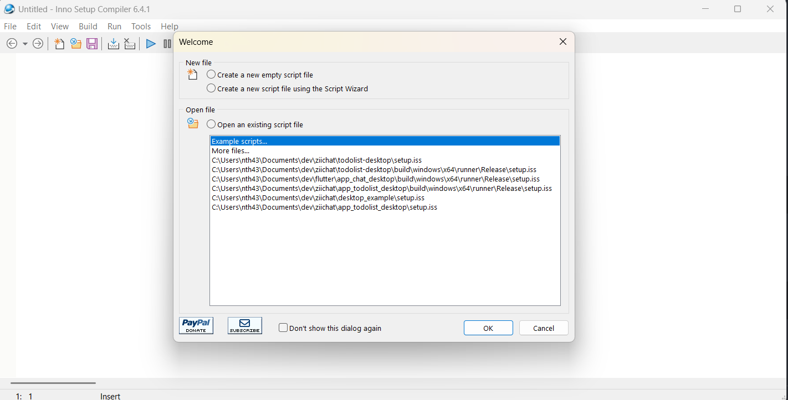

Ở phần new file chọn **create a new script file using the Script Wizard**, sau đó chọn OK để tiếp tục.

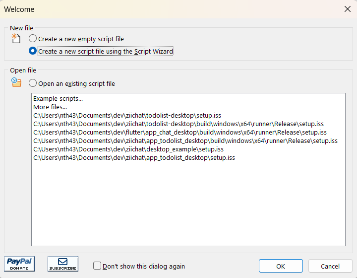

Một vài màn hình tiếp theo sẽ yêu cầu nhập thông tin ứng dụng cơ bản chỉ cần điền vào, không có gì nhiều kỹ thuật ở đó. Nhưng chỉ để tham khảo, đây là một vài ảnh chụp màn hình nhanh:


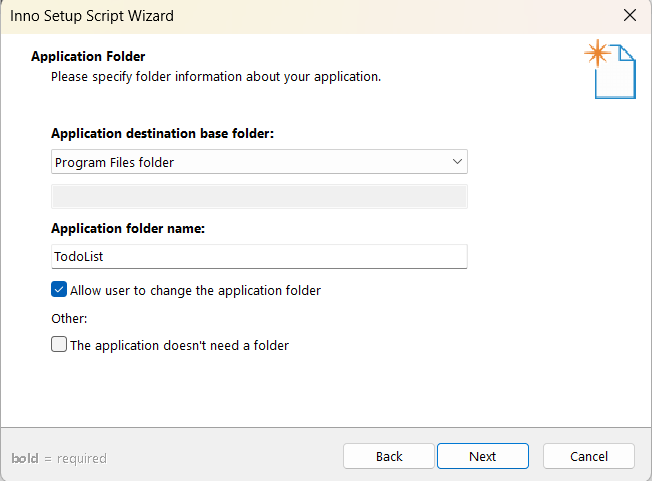

Bây giờ màn hình tiếp theo, đây là điều quan trọng nhất. Phải Chọn **tệp exe của ứng dụng** ở mục **Application main executable file**.


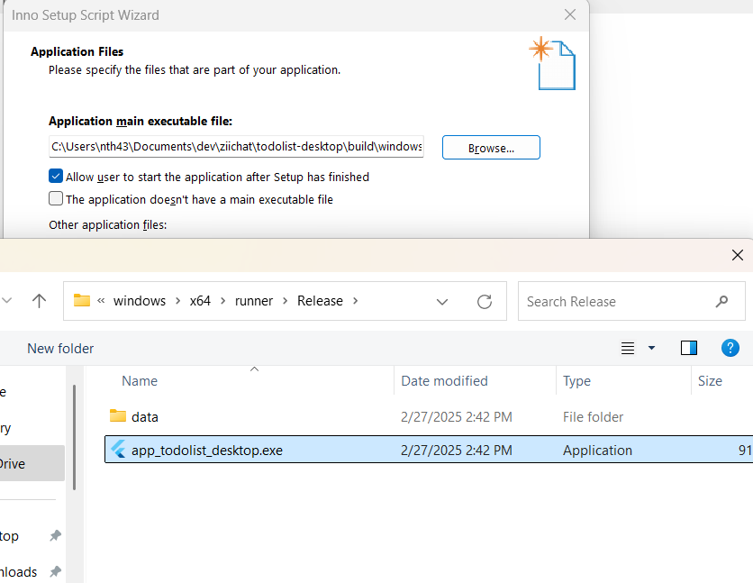

Tiếp theo ở mục **Add files** chọn add tất cả file .dll ở cùng với file .exe sau khi đã build lúc nãy.

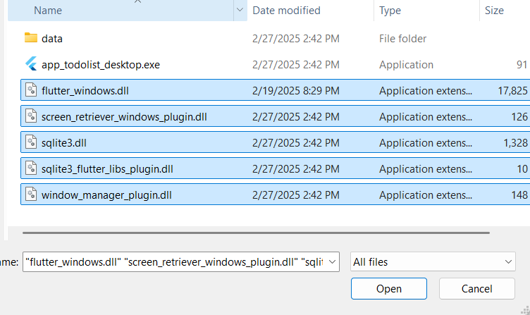

Hình ảnh sau khi add file .dll.

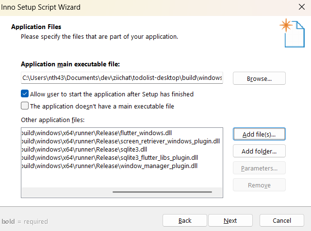

Tiếp theo ở mục **Add folder** chọn thư mục data ở: **"\build\windows\x64\runner\Release\data"**.
<br>Hình ảnh sau khi add folder data vào</br>

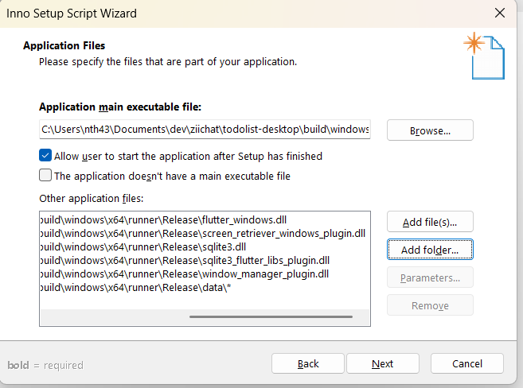

Chọn vào đường dẫn thư mục data vừa thêm vào như hình.

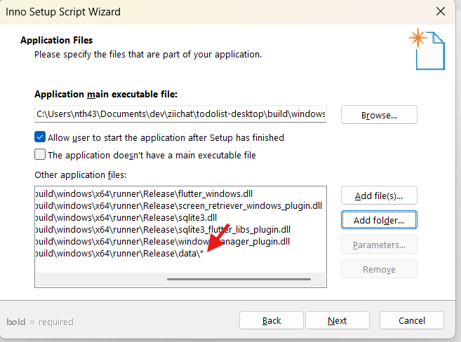

ở popup hiển thị lên nhập **data** ở mục **Destination subfolder** và chọn ok, chọn next để tiếp tục.

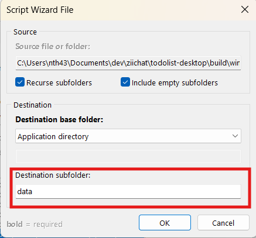

Bỏ tick ở mục như hình, tiếp tục nhấn next.

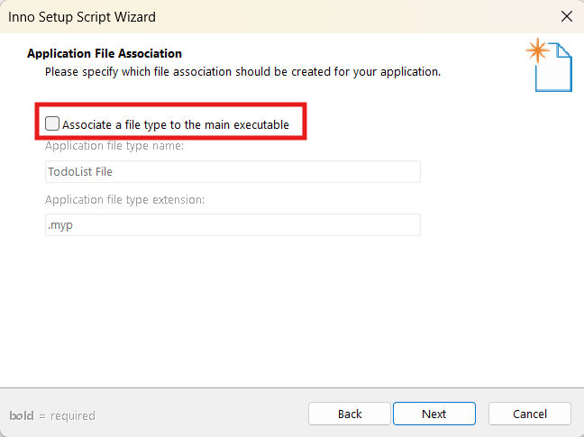

ở màn hình sau chỉ cần nhấn next để tiếp tục. Cho đến màn hình **Compiler Settings**


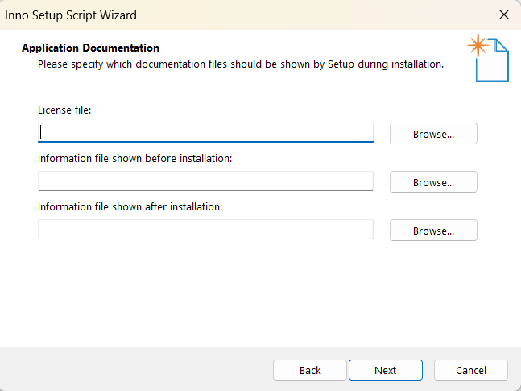

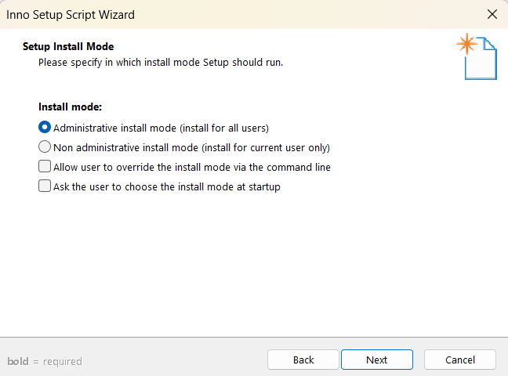

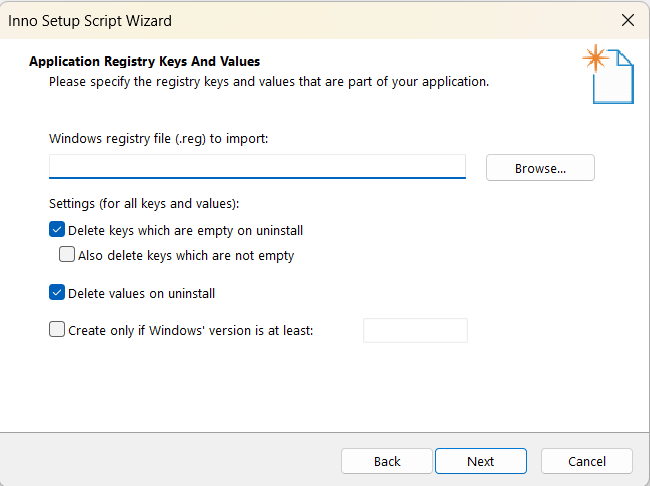

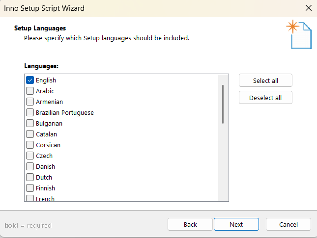

Ở màn hình **Compiler Settings**:

- Custom compiler output folder: để chọn nơi lưu trữ ứng dụng sau khi đã đóng gói.
- Compiler output base file name: Tên file ứng dụng .exe
- Custom setup icon file: icon file ứng dụng (.ico)

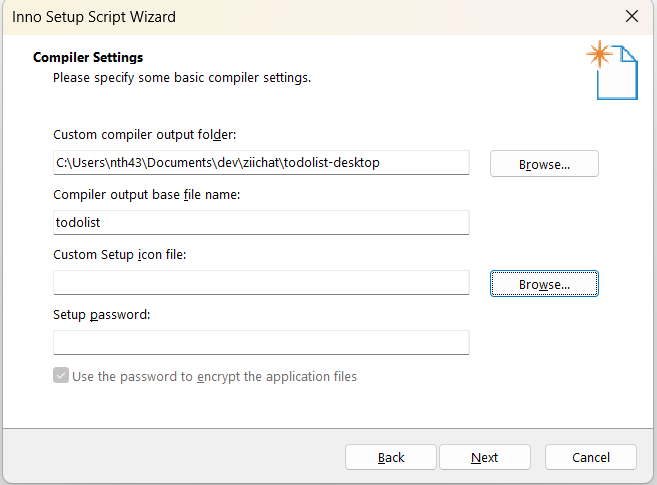

Sau khi hoàn thành các thông tin trên chọn next để tiếp tục
Ở những màn hình tiếp theo nhấn next và finish để hoàn tất quá trình.

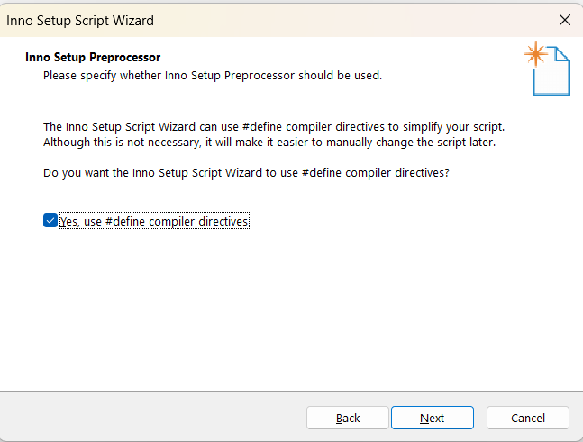

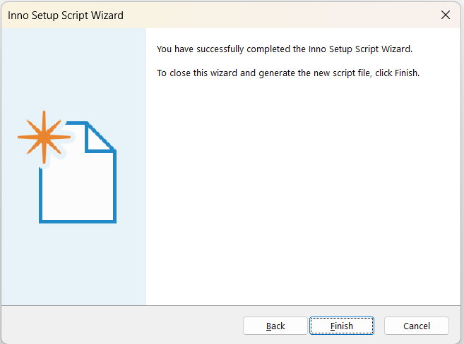

Sau khi hoàn tất cửa số popup hiện lên chọn **Yes** để tạo file script.

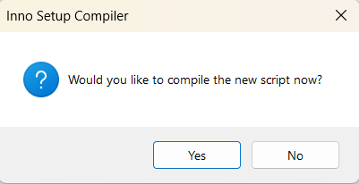

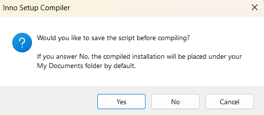

Đặt tên file và nơi lưu trữ file script.

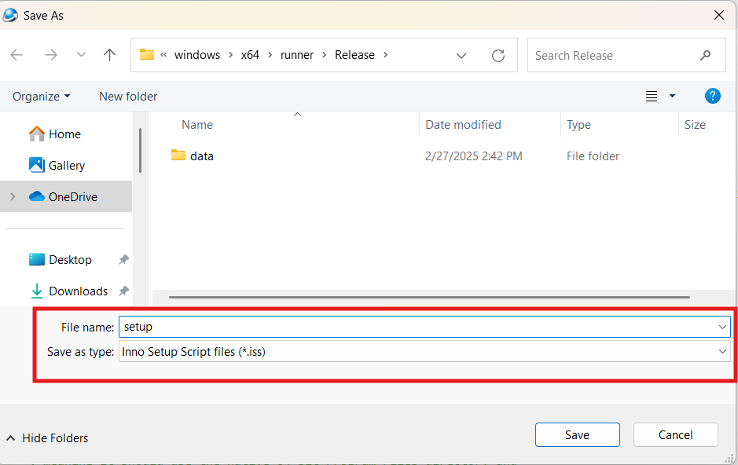

Sau khi nhấn save Inno setup sẽ tạo script và đóng gói ứng dụng.

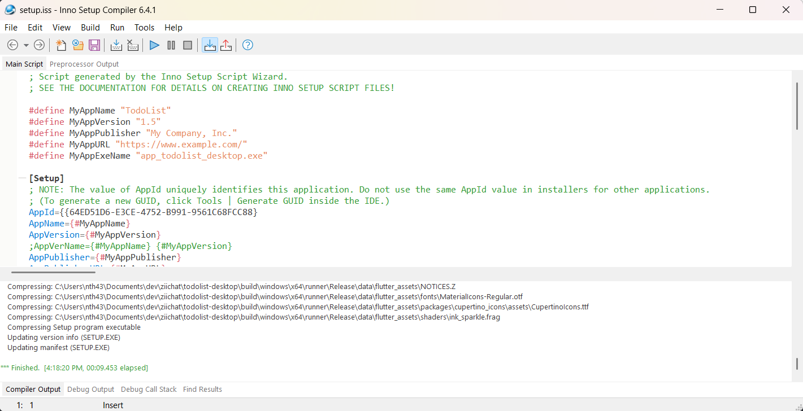

Sau khi đóng gói xong File ứng dụng .exe được lưu trữ theo như đường dẫn lúc nãy đã config.

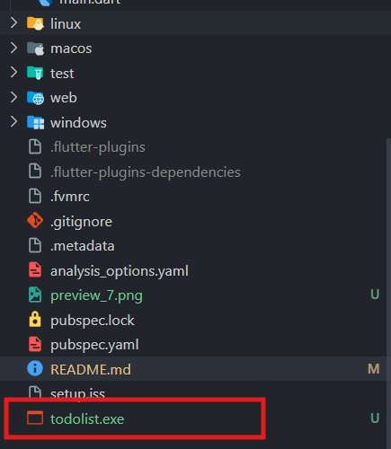

Giờ chỉ cần chạy file .exe để cài đặt ứng dụng.

### 🍎 macos

```sh
flutter build macos
```

Sau khi build xong, ứng dụng .app sẽ nằm trong thư mục: **"build/macos/Build/Products/Release/MyApp.app"**

<br>Cài đặt create-dmg</br>

```sh
npm install -g create-dmg
```

Chạy lệnh sau để tạo file .dmg

```sh
create-dmg \
  "build/macos/Build/Products/Release/MyApp.app" \
  --dmg-title="MyApp" \
  --overwrite \
  --output "build/macos/Build/Products/Release/"
```

output: là nơi lưu trữ file .dmg

### 🐧 Linux

```sh
flutter build linux
```

Ứng dụng sau khi build nằm tại: **"build/linux/x64/release/bundle/"**
